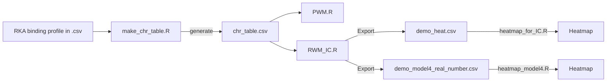

# Application of Position weight matrix plus interaction couple (PWM+IC) to predict RNA/DNA - protein interaction using high-throughput result

## Purpose
Position weight matrix (PWM) has been widely applied to describe nucleotide importance of RNA/DNA - protein interaction. The basic assumption of PWM is that each necleotide does not interact and follows the iid rule in statistics. Which means PWM has limited ability to detected the mutual effects of nucleotides. For example, RNA/DNA have secondary structures and sometimes specific nucleotide pairs in neighbor or separate positions may enhance or decrease the interaction. Therefore we put interaction couple (IC) and trying to describe this phenomenoum, and this is PWM+PC method.

Like PWM, we implement PWM+IC by a linear regression model in R. We add interaction terms into the PWM linear model and do the fitting. The coefficients of each term is extracted and used to describe the rules of RNA/DNA - protein interaction.

In this repository, *Original_Anderson_PWM_IC.R* is the original PWM + IC model file. We mamunaly add the interaction terms into the linear model. But once we have different protein to analyse, it loses the convenience. Therefore the *PWM_IC.R* file solves this issue.

## How to use



### Prepare your input files
Please refer to [demo_data.csv](demo_data.csv) for the information. The data should look like:

| Sequence | RK |
| --- |---|
|AAAAAA	|1.657295597|
|AAAAAC	|1.599794083|
|AAAAAG	|1.33531259|
|AAAAAT	|1.757484504|
|.....|.....|

In this table, RK value can be the result of HiTS-EQ (Binding) or HiTS-KIN (Catalysis). Which means it can be relative association constant (RKA) or relative rate constant (RK).
### Generate the character table
Use [make_char_table.R](make_char_table.R) to generate charater table. This table shoule be in .csv format.

For the demo, please check the file [chr_table.csv](chr_table.csv).

### Run the R code
For PWM model, please use [PWM.R](PWM.R)
For PWM+IC model, please use [PWM_IC.R](PWM_IC.R).

According to the heatmap visualization, there are few parameters need to be set in **PWM_IC.R**. They are

```
write.csv(matrix2, "demo_heat.csv")
write.csv(model4.coef, "demo_model4_real_number.csv")
```
Please change **demo_heat.csv** and **demo_model4_real_number.csv** to your preferred filenames. You will use those two files to visualize the PWM+IC model by heatmap.

### Visualize your result to explore the interaction rules
Now you can use **heatmap_for_IC.R** and import **demo_heat.csv** or your filename to visualize the PWM+IC for your protein.

**heatmap_model4.R** is to visualize the **demo_model4_real_number.csv** file for stepwised result.